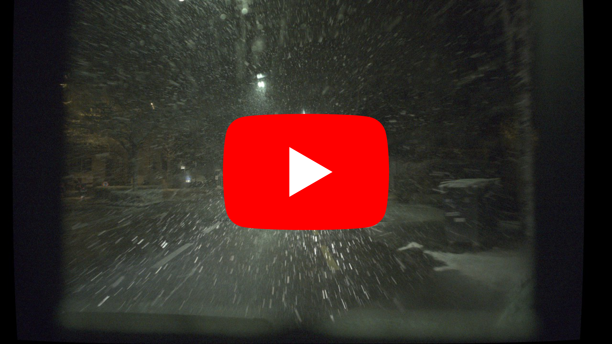

<p align="center">
    <h1 align="center"> Event-Based De-Snowing for Autonomous Drivings </h1>
</p>
<p align="center">
    Manasi Muglikar, Nico Messikommer, Marco Cannici, Davide Scaramuzza<br/>
</p>
<p align="center">
    <i>Robotics and Perception Group, University of Zürich</i>
</p>
<p align="center"> 
    <strong>IEEE Transactions on Robotics (T-RO) 2026</strong>
</p>

<p align="center">
  <a href="https://www.ieee-ras.org/publications/t-ro/">
    
  </a>
  <a href="https://rpg.ifi.uzh.ch/docs/TRO26_Muglikar.pdf">
    
  </a>
  <a href="https://youtu.be/9FneWDDwQ8E">
    
  </a>
  <a href="https://github.com/uzh-rpg/EVSnow/blob/master/LICENSE">
    
  </a>
</p>
<p align="center">
  <a href="https://youtu.be/dVaH0VVXhQc">
    
  </a>
</p>

Code release for the T-RO 2026 paper on event-based image de-snowing for autonomous driving.

## Citation
If you use this codebase, or the datasets accompanying the paper, please cite the following publications:
```bibtex
@inproceedings{muglikar26tro,
  title={Event-Based De-Snowing for Autonomous Driving},
  author={Muglikar, Manasi and Messikommer, Nico and Cannici, Marco and Scaramuzza, Davide},
  booktitle={Transactions of Robotics},
  year={2026}
}

```

## Environment
Verified baseline:
- Python 3.6.13
- PyTorch 1.8.0
- torchvision 0.9.0
- CUDA 11.x

Install dependencies:

```bash
python -m venv .venv
source .venv/bin/activate
pip install --upgrade pip
pip install -r requirements.txt
```

## Dataset Layout
Training and testing scripts expect each sequence folder to contain:

```text
<sequence>/
  masked_images/
  gt_images/
  events/
  voxel/           # generated by preprocess.py
  voxel_20ms/      # used by test.py for DSEC/real driving eval
```

For training, point --train_dir and --test_dir to directories containing per-sequence subfolders.

## Reproducible Pipeline

### 1. Preprocess Events
Generate cached voxel grids from event H5 files:

```bash
bash preprocess.sh
```

Expected behavior:
- One background preprocessing job per sequence (up to MAX_JOBS in the script).
- New .npy files created in each sequence voxel folder.

### 2. Train
Use the provided launcher:

```bash
bash train.sh
```

Or run directly:

```bash
python train.py \
  --arch EvSnowNet_Paper \
  --batch_size 2 \
  --gpu 0 \
  --train_ps 256 \
  --lr_initial 0.0001 \
  --save_dir ./logs \
  --warmup \
  --resume \
  --pretrain_weights ./logs/EvSnowNet_Paper/models/model_epoch_40.pth \
  --train_dir /path/to/dataset/train/ \
  --test_dir /path/to/dataset/test/ \
  --save_images \
  --nepoch 91 \
  --checkpoint 10
```

Expected console output includes lines such as:
- saving to : ./logs/EvSnowNet_Paper
- ===> Loading datasets
- ===> Start Epoch <start>, End Epoch <end>
- Checkpoint saved at epoch <k>!

Artifacts are written to:
- logs/<ARCH>/<timestamp>.txt
- logs/<ARCH>/models/model_epoch_<k>.pth
- logs/<ARCH>/results/train/

### 3. Inference
Run batch testing over subfolders:

```bash
bash test.sh
```

Or run directly for a single sequence:

```bash
python test.py \
  --input_dir /path/to/sequence \
  --result_dir /path/to/output \
  --model_name EvSnowNet_Paper \
  --weights ./logs/EvSnowNet_Paper/models/model_epoch_40.pth \
  --batch_size 1 \
  --has_groundtruth
```

Expected output structure:

```text
<result_dir>/
  image/
  events/
  gt/
  evsnownet_paper/
```

### 4. Metrics
Compute dataset-level PSNR/SSIM:

```bash
python evaluate.py
```

Expected output:
- Per-sequence processing logs.
- Final summary: Dataset Mean PSNR and Dataset Mean SSIM.
- Metrics text file written near the inference root.

## Acknowledgement
The code is derived from multiple sources, in particular [Snowformer](https://github.com/Ephemeral182/SnowFormer) and [RLP](https://github.com/zkawfanx/RLP). Thanks for their great works!
